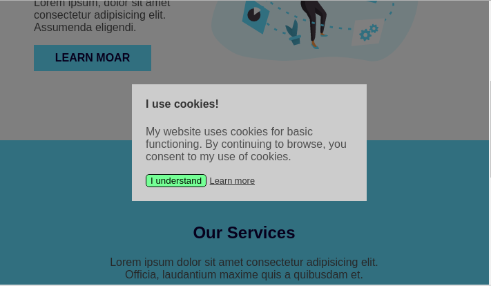

# The centered overlay - cookie prompt

**Instructions**

1. Look at the example webpage provided
2. Add a dark overlay over the page
3. In the middle of the overlay, add Cookie Consent request
4. Make the cookie consent request as close as you possibly can to the mockup image

